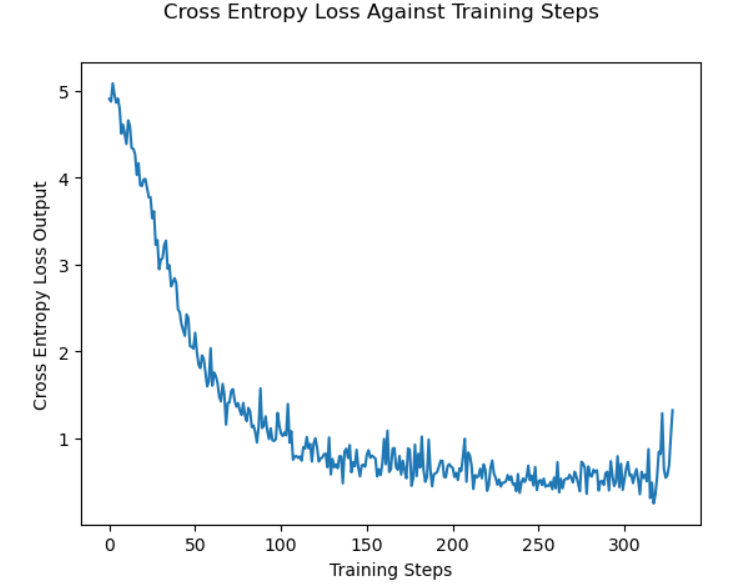
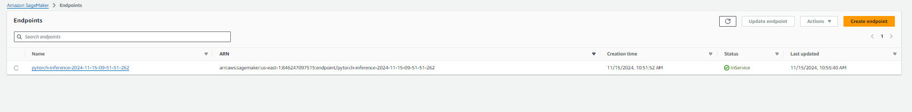

# Image Classification using AWS SageMaker

AWS Sagemaker project to train a pretrained model that can perform image classification by using the Sagemaker profiling, debugger, hyperparameter tuning and allowing queries to the best model via a deployed endpoint. This is done on the dog breed classication data set.

## Project Set Up and Installation
Enter AWS through the gateway in the course and open SageMaker Studio. 
Download the dataset from s3 bucket. 

## Dataset
The dataset is the dogbreed classification dataset which has 133 classes of images of dogs.

### Access
Dataset can be downloaded using the script from the s3 bucket.

## Hyperparameter Tuning
The model chosen was the pretrained Resnet50, which was frozen for training. A fully connected neural network on is then placed behind this to facilitate image classification. The hyperparameters of the fully connected neural network are then tune to optimize performance and minimize loss. Hyperparameters chosen to tune are: 
- lr as in range 0.001 to 0.1. Tested as this is a reasonable range to test without having too severe a learning rate. Optimal value: 0.0014611377532535268
- batch-size between 32, 64, 128. Range of values as balance between accuracy and speed. Optimal value: 64 
- epochs between 2 and 4. Balance again between accuracy and speed. Optimal value: 3

## Debugging and Profiling
Debugging and profiling was used with the following rules are included here: [Profiler Report](./ProfilerReport/profiler-output/profiler-report.html). 
. Included here is a brief summary:
### Step Duration Analysis
- **StepOutlier Rule**: Measures step durations and flags outliers exceeding 3 times the standard deviation.
  - **Parameters**: 
    - Mode: `None` (analyzes both training and validation steps).
    - Outliers Ignored: First 10 steps (`n_outliers=10`).
  - **Analysis**: Analyzed 335 datapoints; triggered 1 time.
### GPU Utilization Analysis
- **LowGPUUtilization Rule**: Monitors low or fluctuating GPU usage.
  - **Analysis**:
    - Checked 8072 datapoints.
    - Found 12 cases where the 95th percentile exceeded 70% and the 5th percentile dropped below 10%.
    - Skipped first 1000 datapoints during initialization.
  - **Recommendation**: 
    - Consider a smaller instance type or increase the batch size to improve utilization.
### Workload Balancing
- **LoadBalancing Rule**: Detects workload distribution issues across GPUs.
  - **Result**: 
    - Only one GPU used during the training job.
    - No workload balancing issues detected.
### Dataloading Analysis
- **Dataloader Workers Rule**: Evaluates the number of dataloader processes compared to available cores.
  - **Result**: 
    - 0 datapoints analyzed.
    - No issues triggered.
### Batch Size
- **BatchSize Rule**: Detects GPU underutilization due to small batch sizes.
  - **Analysis**:
    - Checked over 8071 datapoints in windows of 500 datapoints.
    - No underutilization detected.
    - Skipped the first 1000 initialization datapoints.
### CPU Bottlenecks
- **CPUBottleneck Rule**: Monitors high CPU usage (>90%) with low GPU utilization (<10%).
  - **Result**:
    - 3117 bottlenecks detected (38% of the total time), below the 50% threshold.
    - Skipped the first 1000 initialization datapoints.
### I/O Bottlenecks
- **IOBottleneck Rule**: Monitors high I/O wait time (>50%) with low GPU utilization (<10%).
  - **Result**:
    - Detected 477 bottlenecks (5% of the total time), below the 50% threshold.
    - Skipped the first 1000 initialization datapoints.
### GPU Memory
- **GPUMemoryIncrease Rule**: Detects large increases in GPU memory usage.
  - **Analysis**:
    - Triggered 842 times, with memory utilization fluctuating significantly.
    - Skipped the first 1000 initialization datapoints.
  - **Node algo-1 GPU0 Memory**:
    - Max Utilization: 76.0%.
    - Significant fluctuation detected (5th percentile: 0.0%, 95th percentile: 57%).
 
Profiling revelaed loss is increasing towards the end of the training stage. Fewer epochs should be used going forward. 

## Model Deployment
Model with best hyperparameters is deployed as an endpoint with a single initial 'ml.m5.large'. It is possible to query the endpoint with an image, providing that it is converted to a byte array first. 

